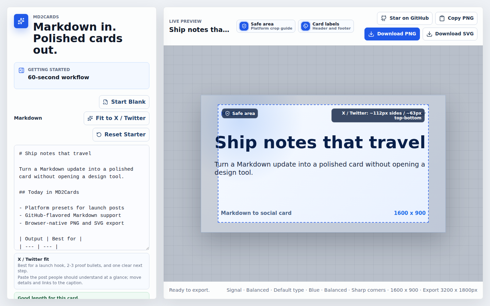

# MD2Cards

Markdown in, polished cards out.

MD2Cards is a local web app for turning Markdown snippets into exportable PNG and SVG social cards. It is built for product launches, release notes, documentation posts, and creator updates where you want a clean image without opening a design tool.



<p align="center"><sub>Paste or import Markdown, choose a platform preset, preview safe areas, share recipe JSON, then export PNG/SVG cards locally.</sub></p>

## Why MD2Cards

- Write once in Markdown, paste text, or import a local `.md`, `.markdown`, or `.txt` file and preview the card live.
- Start from paste-ready examples for launch posts, GitHub releases, and Xiaohongshu-style insight cards.
- Apply curated recipe presets for launches, changelogs, tutorials, insights, quotes, and code snippets.
- Export landscape, portrait, or square cards for common sharing surfaces.
- Save named card presets locally in your browser and reload them for repeat posts.
- Export/import reusable JSON card recipes to move a finished setup between browsers or share it with a teammate.
- Fit pasted Markdown to the selected platform with a local, deterministic compaction helper.
- Check line count, character count, safe areas, and export size before downloading, including on narrow laptop and mobile screens.
- Hide header and footer labels, then copy PNGs to the clipboard, download crisp PNGs, or keep reusable SVG output.

## Quickstart

Live demo: https://junbuilds96.github.io/md2cards/

```bash
npm install
npm run dev
```

Open the local Vite URL on desktop or a narrow screen, choose a starter or recipe preset, select **Start Blank**, paste Markdown, drop in a local `.md`/`.markdown`/`.txt` file, or import a recipe `.json`. Pick a platform preset, theme, density, and accent color, hide **Card labels** if you want to remove the header and footer text, optionally save the setup as a local preset or export the recipe JSON, then use **Copy PNG**, **Download PNG**, or **Download SVG**.

## Common Use Cases

- Launch announcements that need a stronger visual than plain text.
- Changelog and release-note cards for GitHub, docs, and newsletters.
- Technical snippets with headings, lists, tables, code, and quotes.
- Creator or team updates that should fit a known platform crop.

## Workflow

1. Pick a paste-ready template or start with an empty editor.
2. Paste, import, or edit Markdown while the preview updates.
3. Use the fit guidance, one-click platform fitter, and safe-area overlay to keep the card readable.
4. Choose a platform preset, visual theme, appearance, and PNG export quality.
5. Save a named local preset for repeat card setups, or export/import a JSON recipe for sharing across browsers.
6. Copy or download the finished card.

## Features

- GitHub-flavored Markdown rendering with `react-markdown` and `remark-gfm`.
- Local Markdown file import for `.md`, `.markdown`, and `.txt` drafts.
- Browser-based PNG and SVG export powered by `html-to-image`.
- Exact-size PNG and SVG exports use the selected preset bounds without preview-stage padding or safe-area overlays.
- Presets for X/Twitter landscape, Xiaohongshu portrait, and GitHub/launch square.
- Local platform fitter that normalizes spacing, caps long lists, shortens dense paragraphs, and reports what changed.
- Themes for crisp launch notes, editorial posts, paper-style notes, and dark technical updates.
- Appearance controls for Compact, Balanced, and Spacious density plus Blue, Emerald, Rose, and Amber accent swatches.
- Starter templates that map to sensible preset/theme defaults.
- Built-in recipe presets that apply Markdown, platform, theme, density, typography, accent, and label visibility together.
- Browser-local saved presets for Markdown, platform, theme, appearance, and export quality.
- Portable JSON card recipes with schema/version metadata, Markdown, platform, theme, appearance, export quality, and card-label visibility.
- Responsive controls and preview panels for narrow laptop and mobile widths.
- Fast 1x preview export and crisp 2x share export.
- Optional card-label toggle for hiding the MD2Cards header and footer metadata in previews and exports.
- Clipboard PNG support when the browser allows image clipboard writes.

## Tech Stack

- Vite
- React
- TypeScript
- `react-markdown`
- `remark-gfm`
- `html-to-image`
- Vitest

## Scripts

```bash
npm run dev      # Start the local web app
npm run build    # Type-check and build production assets
npm run test     # Run tests
npm run preview  # Preview the production build
```

## Deployment

Pushes to `main` deploy the production build to GitHub Pages at https://junbuilds96.github.io/md2cards/. The workflow builds with `npm ci` and `npm run build`, uploads `dist`, and deploys it with GitHub's official Pages actions.

## Roadmap

- More card templates for launches, docs, changelogs, and creator posts.
- More precise platform guidance as sharing surfaces change.

## Contributing

Issues and pull requests are welcome. For changes that affect rendering or export behavior, include a focused test or a clear manual verification note.

## License

MIT. See [LICENSE](LICENSE).
