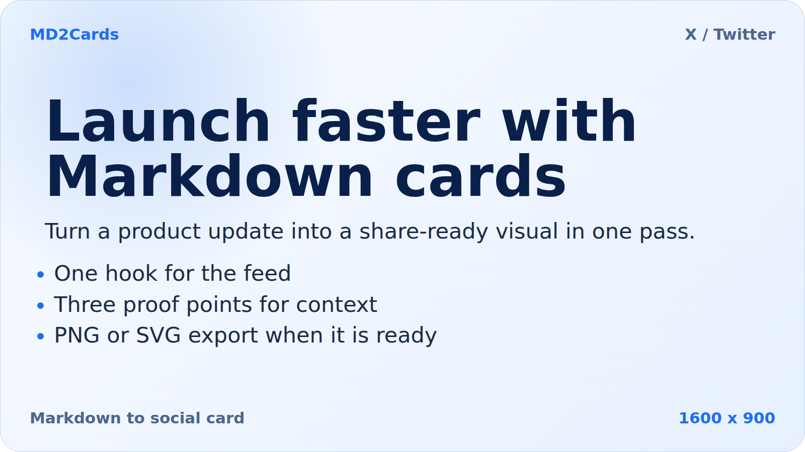
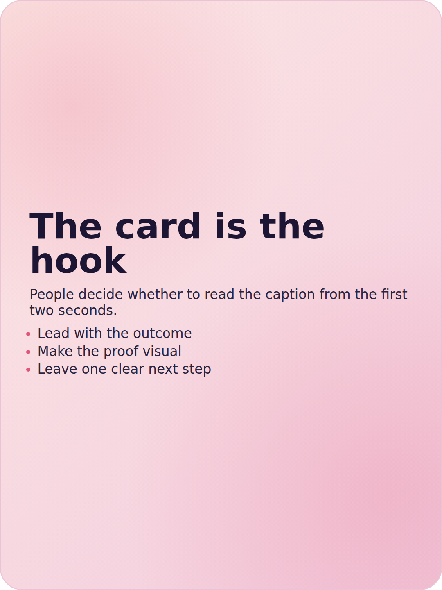
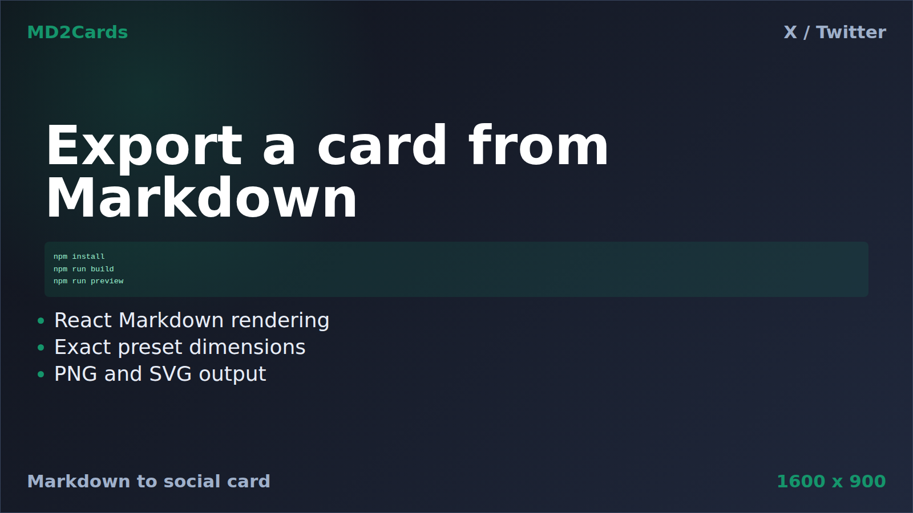

# MD2Cards

Markdown in, polished social cards out.

MD2Cards turns Markdown snippets into exportable PNG and SVG cards for launches, changelogs, documentation posts, and creator updates. Paste a draft, choose a recipe, tune the card, then export locally from the browser.

[Live demo](https://junbuilds96.github.io/md2cards/) · [GitHub](https://github.com/junbuilds96/md2cards)


## Example Outputs

| Launch card | Insight card | Code card |
| --- | --- | --- |
|  |  |  |

## Workflow

1. Paste Markdown, import a `.md`/`.markdown`/`.txt` file, pick a paste-ready example, or start blank.
2. Choose a platform preset for X/Twitter, Xiaohongshu, or GitHub/launch cards.
3. Apply a recipe preset for launches, changelogs, tutorials, insights, quotes, or code snippets.
4. Tune theme, density, type scale, accent, background intensity, corner radius, and export quality.
5. Fit/check the card with line counts, character counts, safe-area guides, and exact export dimensions.
6. Hide header/footer card labels when desired, then copy PNG, download PNG/SVG, or export/import recipe JSON.

The current layout keeps the control panel independently scrollable on desktop while the preview stays fixed. Getting Started is collapsed by default, export actions live beside the preview, and the GitHub star link is always available from the preview toolbar.

## Features

- GitHub-flavored Markdown rendering with headings, lists, tables, code blocks, quotes, and links.
- Platform presets for 1600 x 900 landscape, 1080 x 1440 portrait, and 1200 x 1200 square cards.
- Built-in recipes that set content, platform, theme, appearance, and card-label visibility together.
- Appearance controls for density, typography, accent color, background intensity, and corner radius.
- Local fitting helper for tightening dense Markdown to the selected platform.
- Safe-area overlay for previewing platform crops without changing exports.
- Browser-local saved presets and portable JSON card recipes.
- Clipboard PNG, PNG download, and SVG download powered by local browser rendering.
- Responsive controls and preview panels for desktop, narrow laptop, and mobile screens.

## Local Dev

```bash
npm install
npm run dev
```

## Scripts

```bash
npm run dev      # Start the local web app
npm run build    # Type-check and build production assets
npm run test     # Run tests
npm run preview  # Preview the production build
```

## Deployment

Pushes to `main` deploy the production build to GitHub Pages at https://junbuilds96.github.io/md2cards/.

## Contributing

Issues and pull requests are welcome. For rendering or export changes, include a focused test or a clear manual verification note.

## License

MIT. See [LICENSE](LICENSE).
